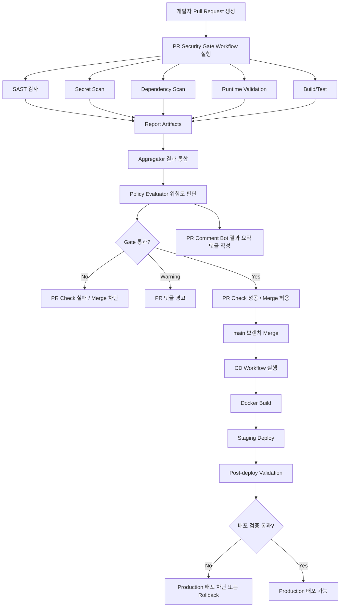

# Secure PR Gate

> CI/CD 파이프라인에 보안 검사를 통합하여, Pull Request 단계에서 취약 코드를 자동으로 탐지하고 Merge를 제어하는 DevSecOps 보안 게이트웨이 시스템

---

## 배경

현대 웹 서비스 개발 환경에서 보안 검토는 대부분 개발 후반부 또는 배포 직전에 이루어진다. 이 경우 취약 코드가 main 브랜치에 병합되거나, 운영 환경까지 전달될 위험이 존재한다.

특히 아래와 같은 문제는 개발 초기에 발견하지 못하면 실제 보안 사고로 이어질 수 있다.

- SQL Injection, XSS, SSRF 등 코드 레벨 취약점
- 하드코딩된 API Key, JWT Secret, DB Password
- 알려진 CVE가 존재하는 취약한 의존성
- CSP, HSTS 등 보안 헤더 미설정

Secure PR Gate는 이 문제를 해결하기 위해, 개발자가 PR을 올리는 시점부터 보안 검사를 자동으로 실행하고, 위험도 기준에 따라 Merge 및 배포를 차단하는 DevSecOps 자동화 시스템이다.

---

## 시스템 개요

Secure PR Gate는 GitHub Actions **Reusable Workflow** 기반 CI/CD 파이프라인 위에 보안 검사, 결과 통합, 정책 판단, PR 피드백, Merge/배포 차단 기능을 결합한 보안 게이트웨이다.

단일 보안 스캐너가 아니라, **여러 보안 도구와 개발 파이프라인을 연결하는 자동화 시스템**이다. 다른 저장소는 이 프로젝트를 복사하지 않고, 얇은 caller workflow로 `@v1` 태그를 호출해 사용한다.



---

## 주요 기능

| 기능 | 설명 |
| --- | --- |
| PR 자동 트리거 | PR 생성 또는 업데이트 시 GitHub Actions 자동 실행 |
| SAST | Semgrep 기반 코드 취약점 정적 분석 (CodeQL 비교 후 기본 도구로 선정) |
| Secret Scan | Gitleaks 기반 API Key, JWT Secret, DB Password 등 민감정보 탐지 |
| Dependency Scan | Trivy 기반 의존성 및 CVE 검사 |
| SBOM | CycloneDX 구성품·버전·의존 관계 목록 (Trivy 생성) |
| DAST | OWASP ZAP + Nuclei 기반 실행 중인 웹 애플리케이션 동적 분석 |
| Runtime Validation | Health Check, Smoke Test, 보안 헤더 검증, DAST 결과 정규화 |
| Aggregator | 각 보안 도구의 결과 파일을 하나의 Summary로 통합 |
| Policy Evaluator | 위험도 및 정책 기준으로 Merge/배포 가능 여부 판단 |
| Merge 차단 | Critical/High 취약점 또는 Secret 탐지 시 PR 자동 차단 |
| PR 댓글 자동화 | 검사 결과, 차단 사유, 수정 가이드를 PR 댓글로 제공 |
| CD Workflow | main Merge 이후 Docker Build 및 Staging 자동 배포 |
| Post-deploy Validation | Staging 배포 후 보안 재검증 수행 |

---

## Security Gate 정책

취약점 위험도에 따라 Merge 처리 방식이 결정된다.

| 조건 | 처리 |
| --- | --- |
| Critical 취약점 탐지 | Merge 차단 |
| High 취약점 탐지 | Merge 차단 |
| Secret 탐지 | Merge 차단 |
| Medium 취약점 탐지 | PR 댓글 경고 |
| Low 취약점 탐지 | 리포트 기록 |
| 검사 통과 | Merge 허용 |

정책 기준은 `security/policies/security-gate-policy.json`에서 관리하며, OWASP/CVSS 기준에 따라 세분화 가능하다.

---

## PR 댓글 예시

PR 보안 검사가 완료되면 아래와 같은 요약 댓글이 자동으로 작성된다.

```
## Secure PR Gate 결과

### 최종 판단
Gate Status: ❌ FAILED

### 검사 요약
| 영역               | 결과    | 요약       |
| ------------------ | ------- | ---------- |
| SAST               | ❌ Failed  | High 1건   |
| Secret Scan        | ✅ Passed  | 탐지 없음  |
| Dependency Scan    | ⚠️ Warning | Medium 2건 |
| Runtime Validation | ✅ Passed  | 이상 없음  |

### 차단 사유
- High 등급 취약점이 탐지되었습니다.

### 수정 가이드
- 수정 후 다시 push하면 Security Gate가 재실행됩니다.
```

---

## 기술 스택

| 영역 | 기술 |
| --- | --- |
| CI/CD | GitHub Actions (Reusable Workflow) |
| Container | Docker |
| SAST | Semgrep |
| Secret Scan | Gitleaks |
| Dependency Scan | Trivy |
| SBOM | CycloneDX |
| DAST | OWASP ZAP, Nuclei |
| Runtime Validation | Health Check, Smoke Test, Security Header Check, 결과 정규화 |
| Aggregator / Policy Evaluator | Python |
| PR Comment | GitHub API |
| Deployment | Docker Build, Staging Deploy |

---

## 다른 프로젝트에서 사용하기

1. [examples/caller-security-gate.yml](examples/caller-security-gate.yml)을  
   `.github/workflows/security-gate.yml`로 복사한다.
2. `uses:` 경로의 태그를 `@v1`(또는 `@v1.0.0`)로 맞춘다.
3. (선택) PR 단계 DAST를 쓰려면 `enable_dast: true`와 `install_command` / `build_command` / `start_command`를 설정한다.  
   EC2는 필수가 아니다. runner에서 앱을 띄운 뒤 localhost 대상으로 검사한다.  
   Staging 배포 후 DAST는 `cd-staging.yml`의 Post-deploy Validation에서 별도로 수행한다.
4. Branch Protection에서 Secure PR Gate Check를 Required로 설정한다.

자세한 연동·inputs·버전 배포·PR/CD DAST 구분은 [docs/pipeline-guide.md](docs/pipeline-guide.md)를 참고한다.

### 버전 태그 배포 (maintainers)

```bash
git tag v1.0.0
git push origin v1.0.0
git tag -f v1 v1.0.0
git push origin v1 --force
```

사용자 측:

```yaml
uses: KT-TECHUP-PROJECT5/secure_gate/.github/workflows/pr-security-gate.yml@v1
```

`with.gate_ref`도 동일 태그(`v1`)로 맞춘다.

---

## 프로젝트 구조

```
.
├── .github/
│   └── workflows/
│       ├── pr-security-gate.yml       # Reusable 보안 게이트 (workflow_call)
│       ├── call-pr-security-gate.yml  # 이 저장소 PR용 caller
│       └── cd-staging.yml             # CD Staging 배포 Workflow
│
├── examples/
│   └── caller-security-gate.yml       # 타 프로젝트 연동 템플릿
│
├── scripts/
│   ├── aggregate-results.py           # 보안 검사 결과 통합
│   ├── evaluate-gate.py               # 정책 기반 Gate 판단
│   └── create-pr-comment.py           # PR 댓글 자동 작성
│
├── security/
│   ├── policies/
│   │   └── security-gate-policy.json  # Merge 차단 정책
│   ├── reports/                        # 보안 검사 결과 저장
│   └── templates/
│       └── pr-comment-template.md      # PR 댓글 템플릿
│
└── docs/
    ├── project.md                 # 프로젝트 가이드
    ├── pipeline-guide.md          # 파이프라인 운영 가이드
    ├── team-interface.md          # 팀 연동 인터페이스 및 협업 프로세스
    └── tasks/
        └── A-part-task.md         # 작업 체크리스트
```

---

## 팀 구성

| 파트 | 역할 |
| --- | --- |
| A. Platform / Pipeline | GitHub Actions 파이프라인 구조, Aggregator, Gate Evaluator, PR 댓글 자동화, CD Workflow |
| B. Application Security / Red Team | 취약점 포함 테스트 앱 구성, 공격 PoC 작성 및 검증 |
| C. Security Scan | Semgrep, Gitleaks, Trivy, SBOM(CycloneDX) 셋업 및 튜닝 |
| D. Runtime Validation | ZAP·Nuclei DAST, 보안 헤더 검증, Health Check, Smoke Test, Staging 배포 후 검증 |
| E. AppSec / Policy / IR | OWASP/CVSS 기반 정책 룰, IR 플레이북, PR 수정 가이드 |

---

## 기대 효과

- Pull Request 단계에서 취약 코드의 main 브랜치 병합 방지
- 보안 검사를 개발 파이프라인에 자연스럽게 통합
- SAST, Secret Scan, Dependency Scan, DAST 결과를 하나의 Gate로 통합
- 개발자에게 PR 댓글로 즉시 수정 가이드 제공
- 배포 전후의 보안 검증 흐름 확보
