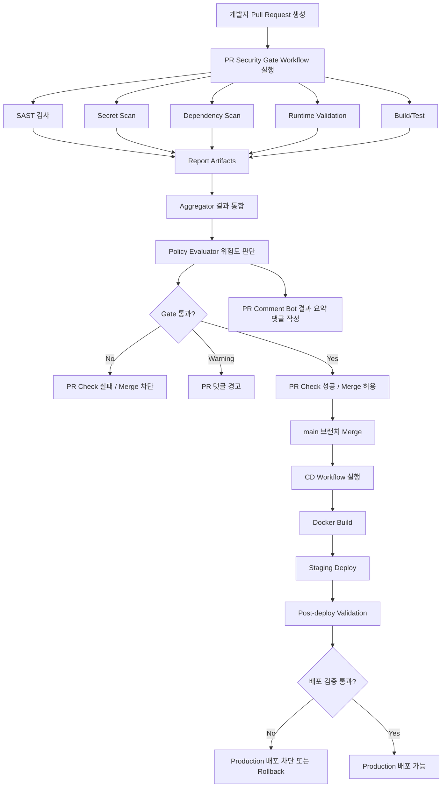

# Secure PR Gate

> CI/CD 파이프라인에 보안 검사를 통합하여, Pull Request 단계에서 취약 코드를 자동으로 탐지하고 Merge를 제어하는 DevSecOps 보안 게이트웨이 시스템

---

## 배경

현대 웹 서비스 개발 환경에서 보안 검토는 대부분 개발 후반부 또는 배포 직전에 이루어진다. 이 경우 취약 코드가 main 브랜치에 병합되거나, 운영 환경까지 전달될 위험이 존재한다.

특히 아래와 같은 문제는 개발 초기에 발견하지 못하면 실제 보안 사고로 이어질 수 있다.

- SQL Injection, XSS, SSRF 등 코드 레벨 취약점
- 하드코딩된 API Key, JWT Secret, DB Password
- 알려진 CVE가 존재하는 취약한 의존성
- CSP, HSTS 등 보안 헤더 미설정

Secure PR Gate는 이 문제를 해결하기 위해, 개발자가 PR을 올리는 시점부터 보안 검사를 자동으로 실행하고, 위험도 기준에 따라 Merge 및 배포를 차단하는 DevSecOps 자동화 시스템이다.

---

## 시스템 개요

Secure PR Gate는 GitHub Actions **Reusable Workflow** 기반 CI/CD 파이프라인 위에 보안 검사, 결과 통합, 정책 판단, PR 피드백, Merge/배포 차단 기능을 결합한 보안 게이트웨이다.

단일 보안 스캐너가 아니라, **여러 보안 도구와 개발 파이프라인을 연결하는 자동화 시스템**이다. 다른 저장소는 이 프로젝트를 복사하지 않고, 얇은 caller workflow로 `@v1` 태그를 호출해 사용한다.



---

## 주요 기능

| 기능 | 설명 |
| --- | --- |
| PR 자동 트리거 | PR 생성 또는 업데이트 시 GitHub Actions 자동 실행 |
| SAST | Semgrep 기반 코드 취약점 정적 분석 (CodeQL 비교 후 기본 도구로 선정) |
| Secret Scan | Gitleaks 기반 API Key, JWT Secret, DB Password 등 민감정보 탐지 |
| Dependency Scan | Trivy 기반 의존성 및 CVE 검사 |
| SBOM | CycloneDX 구성품·버전·의존 관계 목록 (Trivy 생성) |
| Dependency-Track | CycloneDX SBOM 업로드 및 프로젝트별 구성요소 이력 관리 |
| DAST | OWASP ZAP + Nuclei 기반 실행 중인 웹 애플리케이션 동적 분석 |
| Runtime Validation | Health Check, Smoke Test, 보안 헤더, Custom Runtime Check, ZAP/Nuclei 및 Dynatrace 문제 결과 정규화, Trivy CVE 우선 검사 |
| Aggregator | 각 보안 도구의 결과 파일을 하나의 Summary로 통합 |
| Policy Evaluator | 위험도 및 정책 기준으로 Merge/배포 가능 여부 판단 |
| Merge 차단 | Critical/High 취약점 또는 Secret 탐지 시 PR 자동 차단 |
| PR 댓글 자동화 | 검사 결과, 차단 사유, 수정 가이드를 PR 댓글로 제공 |
| CD Workflow | main Merge 이후 Docker Build 및 Staging 자동 배포 |
| Post-deploy Validation | Staging 배포 후 보안 재검증 수행 |

---

## Security Gate 정책

취약점 위험도에 따라 Merge 처리 방식이 결정된다.

| 조건 | 처리 |
| --- | --- |
| Critical 취약점 탐지 | Merge 차단 |
| High 취약점 탐지 | Merge 차단 |
| Secret 탐지 | Merge 차단 |
| Medium 취약점 탐지 | PR 댓글 경고 |
| Low 취약점 탐지 | 리포트 기록 |
| 검사 통과 | Merge 허용 |

정책 기준은 `security/policies/security-gate-policy.json`에서 관리하며, OWASP/CVSS 기준에 따라 세분화 가능하다.

---

## PR 댓글 예시

PR 보안 검사가 완료되면 아래와 같은 요약 댓글이 자동으로 작성된다.

```
## Secure PR Gate 결과

### 최종 판단
Gate Status: ❌ FAILED

### 검사 요약
| 영역               | 결과    | 요약       |
| ------------------ | ------- | ---------- |
| SAST               | ❌ Failed  | High 1건   |
| Secret Scan        | ✅ Passed  | 탐지 없음  |
| Dependency Scan    | ⚠️ Warning | Medium 2건 |
| Runtime Validation | ✅ Passed  | 이상 없음  |

### 차단 사유
- High 등급 취약점이 탐지되었습니다.

### 수정 가이드
- 수정 후 다시 push하면 Security Gate가 재실행됩니다.
```

---

## 기술 스택

| 영역 | 기술 |
| --- | --- |
| CI/CD | GitHub Actions (Reusable Workflow) |
| Container | Docker |
| SAST | Semgrep |
| Secret Scan | Gitleaks |
| Dependency Scan | Trivy |
| SBOM | CycloneDX |
| SCA 추적 | Dependency-Track |
| DAST | OWASP ZAP, Nuclei |
| Observability | Dynatrace OneAgent, Problems API v2 |
| Runtime Validation | Health Check, Smoke Test, Security Header Check, 결과 정규화 |
| Aggregator / Policy Evaluator | Python |
| PR Comment | GitHub API |
| Deployment | Docker Build, Staging Deploy |

---

## 다른 프로젝트에서 사용하기

1. PR 검사용 [examples/caller-security-gate.yml](examples/caller-security-gate.yml)을
   `.github/workflows/security-gate.yml`로 복사한다.
2. Post-merge 검사용 [examples/caller-post-merge-security-gate.yml](examples/caller-post-merge-security-gate.yml)을
   `.github/workflows/post-merge-security-gate.yml`로 복사한다.
3. `uses:` 경로의 태그를 `@v1`(또는 `@v1.0.0`)로 맞춘다.
4. 필요한 Organization Secrets와 Variables를 등록하고 대상 저장소에 접근을 허용한다.
5. Post-merge caller의 `Deploy Staging`을 실제 배포 Workflow `name:`으로 변경한다.
6. Branch Protection에서 Secure PR Gate Check를 Required로 설정한다.

### 검사 모드

| 구분 | 실행 시점 | 주요 동작 |
| --- | --- | --- |
| Soft Gate | Pull Request | Semgrep, Gitleaks, Trivy, SBOM, 선택적 PR DAST |
| Hard Gate | Staging 배포 이후 또는 수동 실행 | Trivy, DT 업로드, ZAP/Nuclei, Dynatrace |

Hard Gate는 Merge 이후 실행되므로 Merge 자체가 아니라 후속 배포를 차단한다.

### Secrets와 Variables

| 구분 | 이름 | 용도 |
| --- | --- | --- |
| Secret | `DEPENDENCY_TRACK_URL` | Dependency-Track Backend API base URL |
| Secret | `DEPENDENCY_TRACK_API_KEY` | SBOM 업로드 API Key |
| Secret | `DYNATRACE_TOKEN` | Hard Gate Dynatrace 조회 Token |
| Secret | `DISCORD_WEBHOOK_URL` | 선택적 Gate 결과 알림 |
| Variable | `STAGING_URL` | Hard Gate 검사 대상 URL |
| Variable | `DYNATRACE_ENV_URL` | Dynatrace Environment URL |
| Variable | `DYNATRACE_PROBLEM_SELECTOR` | Problems API selector |
| Variable | `DYNATRACE_ENTITY_SELECTOR` | 애플리케이션 Entity selector |
| Variable | `DYNATRACE_SERVICE_ENTITY_SELECTOR` | 서비스 Entity selector |

공통 값은 Organization 수준에 등록하고 `Selected repositories`로 필요한 저장소만 허용한다.
Secret 실제 값은 코드나 README에 작성하지 않는다.

### 주요 입력값

```yaml
with:
  gate_repository: KT-TECHUP-PROJECT5/secure_gate
  gate_ref: v1
  dockerfile_path: apps/api/Dockerfile       # 선택: 비우면 루트에서 자동 탐지
  docker_build_context: apps/api             # 선택: 기본값 .
  dependency_track_service_name: backend     # 선택: 모노레포 서비스명
  dependency_track_project_version: main
  dependency_track_upload_mode: main-only    # main-only | always | never
```

- PR에서는 `main-only`가 기본이며 DT 업로드를 skip하고 SBOM Artifact만 생성한다.
- `always`는 PR에서 DT 연결을 시험하는 PoC 용도로만 사용한다.
- Hard Gate는 SBOM을 DT에 필수 업로드한다.
- Dockerfile이 있으면 Trivy Image Scan, 없으면 Filesystem Scan을 수행한다.
- CycloneDX SBOM은 Dependency-Track 호환을 위해 specVersion `1.6`으로 고정한다.

PR 단계에서 앱을 실행해 DAST를 사용하려면 `enable_dast: true`와
`install_command`, `build_command`, `start_command`를 설정한다.

### 결과 확인

GitHub의 `Actions → 실행 선택 → Artifacts`에서 결과를 내려받는다.

| Artifact | 결과 |
| --- | --- |
| `sast-report` | Semgrep 결과 |
| `secret-report` | Gitleaks 결과 |
| `dependency-report` | Trivy CVE 결과 |
| `sbom` | CycloneDX SBOM |
| `dependency-track-upload-report` | DT 업로드 상태 |
| `runtime-report` | Runtime Validation 통합 결과 |
| `gate-decision` | Summary와 최종 Gate 판정 |
| `post-merge-dependency-reports` | Hard Gate Trivy·SBOM·DT 결과 |
| `post-merge-runtime-reports` | Hard Gate ZAP·Nuclei·Dynatrace 결과 |
| `post-merge-gate-results` | Hard Gate 최종 판정 |

DT 업로드 성공은 `dependency-track-upload-report.json`의
`status: succeeded`, `reason: bom-received`로 확인한다.
이는 SBOM 접수 성공을 의미하며 내부 취약점 분석 완료 여부는 DT UI에서 확인한다.

자세한 연동 방법은 [Pipeline Guide](docs/pipeline-guide.md),
[Dependency-Track Guide](docs/dependency-track.md),
[Runtime Validation Guide](docs/runtime-validation-guide.md)를 참고한다.

### 테스트

- Soft Gate: 테스트 브랜치를 push하고 `main` 대상 PR을 생성한다.
- Hard Gate: 필수 설정 등록 후 `Actions → Manual - Staging Security Validation → Run workflow`를 실행한다.

AI/LLM 보고서는 [AI 입력 계약](docs/AI-reference.md)만 정의되어 있으며
현재 Workflow에는 실제 LLM API 호출 단계가 연결되어 있지 않다.

### 버전 태그 배포 (maintainers)

```bash
git tag v1.0.0
git push origin v1.0.0
git tag -f v1 v1.0.0
git push origin v1 --force
```

사용자 측:

```yaml
uses: KT-TECHUP-PROJECT5/secure_gate/.github/workflows/pr-security-gate.yml@v1
```

`with.gate_ref`도 동일 태그(`v1`)로 맞춘다.

---

## 프로젝트 구조

```
.
├── .github/
│   └── workflows/
│       ├── pr-security-gate.yml         # Soft Gate Reusable Workflow (workflow_call)
│       ├── post-merge-security-gate.yml # Hard Gate Reusable Workflow (workflow_call)
│       ├── call-pr-security-gate.yml    # 이 저장소 PR용 caller
│       └── cd-staging.yml               # Hard Gate 수동 실행 Workflow
│
├── examples/
│   ├── caller-security-gate.yml            # 타 프로젝트 PR 연동 템플릿
│   └── caller-post-merge-security-gate.yml # 타 프로젝트 Post-merge 연동 템플릿
│
├── scripts/
│   ├── aggregate-results.py           # 보안 검사 결과 통합
│   ├── evaluate-gate.py               # 정책 기반 Gate 판단
│   ├── create-pr-comment.py           # PR 댓글 자동 작성
│   ├── upload-sbom-to-dependency-track.py # SBOM을 Dependency-Track에 업로드
│   ├── runtime-validation.py          # D파트 Runtime Validation 통합 및 필수 결과 검증
│   ├── fetch-dynatrace-problems.py    # Dynatrace Problems와 서비스 탐지 상태 수집
│   ├── run-zap-validation.py          # ZAP PR Baseline/Post-merge Full Scan 실행
│   ├── trivy-to-nuclei.py             # Trivy High/Critical CVE를 Nuclei 입력으로 변환
│   └── run-nuclei-validation.py       # Nuclei PR/Post-merge 프로필 및 CVE 결과 통합
│
├── security/
│   ├── policies/
│   │   └── security-gate-policy.json  # Merge 차단 정책
│   ├── reports/                        # 보안 검사 결과 저장
│   └── templates/
│       └── pr-comment-template.md      # PR 댓글 템플릿
│
└── docs/
    ├── project.md                 # 프로젝트 가이드
    ├── pipeline-guide.md          # 파이프라인 운영 가이드
    ├── team-interface.md          # 팀 연동 인터페이스 및 협업 프로세스
    └── tasks/
        ├── A-part-task.md         # A파트 작업 체크리스트
        └── C-part-task.md         # C파트 작업 체크리스트
```

---

## 팀 구성

| 파트 | 역할 |
| --- | --- |
| A. Platform / Pipeline | GitHub Actions 파이프라인 구조, Aggregator, Gate Evaluator, PR 댓글 자동화, CD Workflow |
| B. Application Security / Red Team | 취약점 포함 테스트 앱 구성, 공격 PoC 작성 및 검증 |
| C. Security Scan | Semgrep, Gitleaks, Trivy, SBOM(CycloneDX) 셋업 및 튜닝 |
| D. Runtime Validation | ZAP·Nuclei DAST, 보안 헤더 검증, Health Check, Smoke Test, Staging 배포 후 검증 |
| E. AppSec / Policy / IR | OWASP/CVSS 기반 정책 룰, IR 플레이북, PR 수정 가이드 |

---

## 기대 효과

- Pull Request 단계에서 취약 코드의 main 브랜치 병합 방지
- 보안 검사를 개발 파이프라인에 자연스럽게 통합
- SAST, Secret Scan, Dependency Scan, DAST 결과를 하나의 Gate로 통합
- 개발자에게 PR 댓글로 즉시 수정 가이드 제공
- 배포 전후의 보안 검증 흐름 확보

## 소프트 모드 테스트를 위한 코드 수정
-- 코드 수정.