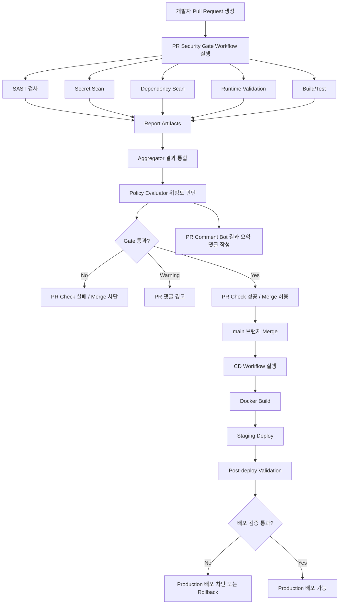

# Secure PR Gate 프로젝트 기획서

## 1. 프로젝트 개요

### 프로젝트명

**Secure PR Gate**

### 프로젝트 분류

**CI/CD 기반 DevSecOps 보안 게이트웨이 시스템**

### 한 줄 설명

Pull Request와 배포 파이프라인에서 보안 검사를 자동 수행하고, 결과를 통합 분석하여 Merge와 배포 여부를 제어하는 DevSecOps 자동화 시스템이다.

---

## 2. 프로젝트 배경

현대 웹 서비스 개발 환경에서는 빠른 기능 개발과 배포가 중요해지면서, 보안 검토가 개발 후반부나 배포 직전에 이루어지는 경우가 많다. 이 경우 취약 코드가 main 브랜치에 병합되거나, 운영 환경까지 전달될 위험이 존재한다.

특히 SQL Injection, XSS, SSRF, 하드코딩된 Secret, 취약한 의존성, 보안 헤더 미설정과 같은 문제는 개발 단계에서 조기에 탐지하지 못하면 실제 보안 사고로 이어질 수 있다.

본 프로젝트는 GitHub Actions Reusable Workflow 기반 CI/CD 파이프라인에 보안 검사를 통합하여, Pull Request 단계에서 취약 코드를 사전에 탐지하고, 위험도 기준에 따라 Merge를 차단하거나 경고하는 DevSecOps 보안 게이트웨이 시스템을 구축하는 것을 목표로 한다. 다른 저장소는 프로젝트 전체를 복사하지 않고, 얇은 caller workflow로 Secure PR Gate를 호출하여 사용한다.

---

## 3. 프로젝트 목표

### 핵심 목표

CI/CD 파이프라인에 SAST, Secret Scan, 의존성 검사, DAST, Runtime Validation을 통합하고, 각 검사 결과를 Aggregator에서 수집·분석한 뒤 정책 기준에 따라 Pull Request Merge 및 배포 여부를 제어한다.

### 세부 목표

- PR 생성 시 GitHub Actions 기반 보안 검사 자동 실행
- SAST를 통한 코드 취약점 탐지
- Secret Scan을 통한 하드코딩된 민감정보 탐지
- 의존성 검사를 통한 CVE 탐지
- DAST를 통한 실행 중인 웹 애플리케이션 동적 분석
- Health Check, Smoke Test, 보안 헤더 검증 등 Runtime Validation 수행
- 각 보안 검사 결과 통합 및 정책 기반 판단
- Critical/High 취약점 또는 Secret 탐지 시 Merge 차단
- PR 댓글을 통해 취약점 요약 및 수정 가이드 제공
- main Merge 이후 Docker Build 및 Staging 배포 흐름 확장
- 배포 후 검증 결과에 따라 Production 배포 가능 여부 판단

---

## 4. 프로젝트 성격

본 프로젝트는 CI/CD 도구 자체를 새로 만드는 것이 아니라, GitHub Actions 기반 CI/CD 파이프라인 위에 보안 검사, 결과 통합, 정책 판단, PR 피드백, Merge/배포 차단 기능을 결합한 DevSecOps 보안 게이트웨이 시스템이다.

즉, 단일 프로그램이나 단순 보안 스캐너가 아니라, 여러 보안 도구와 개발 파이프라인을 연결하는 자동화 시스템에 가깝다.

배포 형태는 서버 애플리케이션이 아니라 **Reusable Workflow + Git 태그(`@v1`)** 이다. 사용자 프로젝트는 PR 이벤트를 받는 caller만 추가하고, 핵심 실행 로직은 `secure_gate` 저장소의 reusable workflow가 담당한다.

---

## 5. 전체 흐름



---

## 6. 주요 기능

| 기능                   | 설명                                                            |
| ---------------------- | --------------------------------------------------------------- |
| PR 자동 트리거         | PR 생성 또는 업데이트 시 GitHub Actions 실행                    |
| SAST                   | Semgrep 기반 코드 취약점 정적 분석 (기본 도구)                  |
| Secret Scan            | Gitleaks 기반 API Key, JWT Secret, DB Password 등 민감정보 탐지 |
| Dependency Scan        | Trivy 기반 의존성 및 CVE 검사                                   |
| SBOM                   | CycloneDX 형식 구성품·버전·의존 관계 목록 (Trivy로 생성)        |
| DAST                   | OWASP ZAP + Nuclei 기반 실행 중인 웹 애플리케이션 동적 분석     |
| Health Check           | 배포된 서비스의 기본 정상 동작 확인                             |
| Smoke Test             | 로그인, 주요 API, 핵심 페이지 등 기본 기능 검증                 |
| 보안 헤더 검증         | CSP, HSTS, X-Frame-Options 등 기본 보안 설정 확인               |
| Runtime Observability  | Dynatrace OneAgent와 Problems API로 Staging 장애·성능 문제 수집 |
| Aggregator             | 각 도구의 결과 파일을 통합                                      |
| Policy Evaluator       | 위험도 및 정책 기준으로 Merge/배포 가능 여부 판단               |
| Merge 차단             | Critical/High 취약점 또는 Secret 탐지 시 PR 차단                |
| PR 댓글 자동화         | 검사 결과, 차단 사유, 수정 가이드를 PR 댓글로 제공              |
| CD Workflow            | main Merge 이후 Docker Build 및 Staging 배포                    |
| Post-deploy Validation | Staging 배포 후 Health Check / Smoke Test / DAST 재검증         |

---

## 7. 기술 스택

| 영역               | 기술                                                              |
| ------------------ | ----------------------------------------------------------------- |
| CI/CD              | GitHub Actions (Reusable Workflow)                                |
| Container          | Docker                                                            |
| SAST               | Semgrep (기본). CodeQL은 비교 검토 후 미선정                      |
| Secret Scan        | Gitleaks                                                          |
| Dependency Scan    | Trivy (CVE)                                                       |
| SBOM               | CycloneDX (Trivy 생성)                                            |
| DAST               | OWASP ZAP, Nuclei                                                 |
| Observability      | Dynatrace OneAgent, Problems API v2                               |
| Runtime Validation | Health Check, Smoke Test, Security Header Check, 결과 정규화      |
| Report Format      | JSON, SARIF, Markdown, HTML                                       |
| Aggregator         | Python Script                                                     |
| Policy Evaluator   | Python Script                                                     |
| PR Comment         | GitHub Script / GitHub API                                        |
| Deployment         | Docker Build, Staging Deploy                                      |

---

## 8. 역할 분담

| 파트                               | 역할                                                                                                      |
| ---------------------------------- | --------------------------------------------------------------------------------------------------------- |
| A. Platform / Pipeline             | GitHub Actions, PR 트리거, Aggregator 뼈대, Merge 차단, PR 댓글 자동화, CD Workflow, Docker Build/CD 연동 |
| B. Application Security / Red Team | 앱 코드와 취약점 통합, 공격 PoC 작성 및 검증, 오탐/미탐 교차검증                                          |
| C. Security Scan                   | Semgrep/Gitleaks/Trivy 셋업·튜닝, SBOM(CycloneDX) 생성, 원본 JSON 연동                                    |
| D. Runtime Validation              | ZAP·Nuclei DAST, 보안 헤더, Health/Smoke, Dynatrace 문제 수집·정규화, Staging 배포 후 검증                 |
| E. AppSec / Policy / IR            | OWASP/CVSS 기준, 정책 룰, IR 플레이북, PR 댓글 수정 가이드 템플릿                                         |

---

## 9. A 파트 담당 범위

A 파트는 전체 파이프라인의 중심 구조를 담당한다. 각 보안 도구의 세부 튜닝을 직접 수행하기보다는, 각 파트에서 생성한 결과물을 CI/CD 파이프라인 안에서 실행·수집·판단·표시할 수 있는 구조를 만든다.

### A 파트 주요 작업

- GitHub Actions PR 트리거 구성
- Security Scan Job 실행 구조 구성
- 결과 Artifact 저장 구조 구성
- Aggregator 스크립트 뼈대 작성
- Gate Evaluator 스크립트 뼈대 작성
- Merge 차단 메커니즘 구성
- PR 댓글 자동화 메커니즘 구성
- main Merge 이후 CD Workflow 구성
- Docker Build 및 Staging Deploy Hook 구성
- Post-deploy Validation 연결 지점 구성

---

## 10. A 파트 예상 디렉터리 구조

```text
.github/
  workflows/
    pr-security-gate.yml          # reusable (workflow_call)
    call-pr-security-gate.yml     # 이 저장소 PR용 caller
    cd-staging.yml

examples/
  caller-security-gate.yml        # 타 프로젝트 연동 템플릿

security/
  reports/
    .gitkeep

  policies/
    security-gate-policy.json

  templates/
    pr-comment-template.md

scripts/
  aggregate-results.py
  evaluate-gate.py
  create-pr-comment.py
  runtime-validation.py
  fetch-dynatrace-problems.py
  run-zap-validation.py
  trivy-to-nuclei.py
  run-nuclei-validation.py

docs/
  pipeline-guide.md
  team-interface.md
```

---

## 10.1 배포 및 타 프로젝트 연동

Secure PR Gate의 “배포”는 다음을 의미한다.

1. `pr-security-gate.yml`을 `workflow_call` reusable로 유지
2. `v1` / `v1.x.y` Git 태그로 버전 고정
3. 사용자 저장소에 caller workflow 추가 (`examples/caller-security-gate.yml` 참고)

사용자 최소 준비물:

- caller YAML (`on: pull_request` + `uses: ...@v1`)
- (선택) 정책 파일
- (선택, DAST) install/build/start 명령 또는 `target_url`

### 10.2 SAST 도구 선정

동일 대상(`web/`)에서 Semgrep과 CodeQL을 비교한 뒤 **Semgrep을 기본 SAST로 확정**했다.

| 판단 기준 | 결과 |
| --- | --- |
| SQL Injection | 두 도구 모두 2건 탐지 |
| Jinja `\| safe` XSS | Semgrep 4건 / CodeQL 0건 |
| Open Redirect | CodeQL 1건 단독 탐지 |
| Gate 연동 | Semgrep JSON 계약이 이미 적용됨. CodeQL은 SARIF 파서 추가 필요 |
| 규칙 유지보수 | Semgrep YAML 커스텀이 팀에 유리 |

CodeQL로 교체하지 않고 Semgrep을 고도화한다. CodeQL이 탐지한 Open Redirect는 Semgrep 커스텀 규칙으로 보완한다.
상세 근거: `docs/sast/sast-tool-selection-summary.md`

### 10.3 의존성 검사와 SBOM

| 산출물 | 역할 |
| --- | --- |
| Trivy CVE 보고서 | 무엇이 취약한가 (CVE, Severity, FixedVersion) — Gate 판정 입력 |
| CycloneDX SBOM | 무엇이 들어있는가 (Component, Version, PURL, 의존 관계) |
| Dependency-Track | SBOM/SCA 추적 대시보드. `secure-gate/github/<owner>/<repo>[/<service>]` + main, autoCreate. Gate 판정기 아님. 상세: `docs/dependency-track.md` |

같은 Trivy로 생성할 수 있지만 용도가 다르다. SBOM의 빈 `vulnerabilities[]`를 “취약점 없음”으로 해석하지 않는다.
Secure Gate는 CycloneDX **specVersion 1.6**으로 고정한다 (Dependency-Track 5.0.x 호환).
Dependency-Track `status=succeeded`는 BOM **수신 성공**이며 내부 취약점 분석 완료를 보장하지 않는다. `DEPENDENCY_TRACK_URL`은 Backend API base URL이다.

### 10.4 PR DAST와 Staging CD DAST

DAST는 두 단계에서 목적과 환경이 다르다. 둘 다 활성화하면 검사가 두 번 실행될 수 있다.

| 단계 | 환경 | 목적 | 상태 |
| --- | --- | --- | --- |
| PR Security Gate | GitHub runner-local 또는 지정 `target_url` | Merge 전 경량·선택적 동적 검사 (`enable_dast`) | runner-local 구조 지원 |
| Staging CD | 실제 Staging 배포 환경 | 배포 후 Health Check / Smoke Test / DAST 재검증 | `cd-staging.yml` Placeholder |

- PR 단계 DAST는 EC2 없이도 가능하다. runner에서 앱을 기동한 뒤 `localhost`를 대상으로 ZAP·Nuclei를 실행하는 방식을 기본 확장 경로로 둔다.
- Staging CD는 `push to main` 이후 `cd-staging.yml`이 Docker Build → Staging Deploy → Post-deploy Validation을 수행하는 **목표 구조**다.
- Runtime Validation의 `failed` 상태는 Aggregator·Policy Evaluator로 전달되고, Required Check 실패로 Merge를 차단하는 것이 최종 목표다.

---

## 11. Security Gate 정책

초기 정책은 단순한 기준으로 시작하고, E 파트의 OWASP/CVSS 기준이 확정되면 구체화한다.

### 초기 정책 예시

```json
{
  "blockOnCritical": true,
  "blockOnHigh": true,
  "blockOnSecret": true,
  "warnOnMedium": true
}
```

### 위험도별 처리 기준

| 조건                 | 처리         |
| -------------------- | ------------ |
| Critical 취약점 탐지 | Merge 차단   |
| High 취약점 탐지     | Merge 차단   |
| Secret 탐지          | Merge 차단   |
| Medium 취약점 탐지   | PR 댓글 경고 |
| Low 취약점 탐지      | 리포트 기록  |
| 검사 통과            | Merge 허용   |

---

## 12. 결과 파일 구조

각 파트의 보안 검사 결과는 아래 경로에 저장하는 것을 목표로 한다.

```text
security/reports/
  sast-report.json
  secret-report.json
  dependency-report.json
  zap-report.json
  nuclei-report.jsonl
  dynatrace-problems.json
  runtime-report.json
  security-summary.json
  gate-decision.json
```

Aggregator는 각 결과 파일을 수집하여 `security-summary.json`을 생성하고, Policy Evaluator는 이를 기반으로 `gate-decision.json`을 생성한다.

---

## 13. 파트별 연동 요청 사항

### B 파트: Application Security / Red Team

A 파트에 전달해야 할 항목:

- 취약점이 포함된 테스트 앱 브랜치 또는 코드 경로
- 취약 API 목록
- 공격 PoC 목록
- 각 PoC 실행 방법
- 탐지되어야 하는 취약점 목록
- 정상 탐지 / 미탐 / 오탐 검증 기준

---

### C 파트: Security Scan

A 파트에 전달해야 할 항목:

- Semgrep 실행 명령어
- Semgrep 설정 파일 경로
- SAST 결과 파일 경로
- Gitleaks 실행 명령어
- Gitleaks 결과 파일 경로
- Trivy 실행 명령어
- Trivy 결과 파일 경로
- 각 도구의 실패 기준
- SARIF 또는 JSON 출력 형식

---

### D 파트: Runtime Validation

A 파트에 전달해야 할 항목:

- Staging 실행 방식
- Staging URL
- Health Check Endpoint
- Smoke Test 실행 명령어
- ZAP 실행 명령어
- ZAP 결과 파일 경로
- Nuclei 실행 명령어
- Nuclei 결과 파일 경로
- Trivy High/Critical CVE 기반 Nuclei 우선 검사 명령어
- Dynatrace Problems API 수집 명령어와 결과 파일 경로
- Dynatrace Environment URL, Problem Selector, 필요한 Secret/Variable
- 보안 헤더 검증 기준
- Runtime Validation 실패 기준

---

### E 파트: AppSec / Policy / IR

A 파트에 전달해야 할 항목:

- Merge 차단 기준
- Warning 처리 기준
- CVSS 등급 기준
- 도구별 Severity 매핑 기준
- PR 댓글 템플릿
- 취약점별 수정 가이드
- IR 플레이북 연결 기준

---

## 14. PR 댓글 예시

```markdown
## Secure PR Gate 결과

### 최종 판단

Gate Status: Failed

### 검사 요약

| 영역               | 결과    | 요약       |
| ------------------ | ------- | ---------- |
| SAST               | Failed  | High 1건   |
| Secret Scan        | Passed  | 탐지 없음  |
| Dependency Scan    | Warning | Medium 2건 |
| Runtime Validation | Passed  | 이상 없음  |

### 차단 사유

- High 등급 SQL Injection 위험이 탐지되었습니다.

### 수정 가이드

- 사용자 입력값을 SQL 문자열에 직접 결합하지 말고 Parameter Binding 또는 QueryBuilder를 사용하세요.
- 수정 후 다시 push하면 Security Gate가 재실행됩니다.
```

---

## 15. CD 및 배포 후 검증 확장

기본 범위는 PR 단계 보안 검사와 Merge 차단으로 설정한다.
추가 과업으로 main 브랜치 Merge 이후 Staging 자동 배포와 배포 후 보안 검증을 확장한다.

### CD 확장 흐름

```text
PR 보안 검사 통과
        ↓
main 브랜치 Merge
        ↓
CD Pipeline 실행
        ↓
Docker Build
        ↓
Staging 환경 자동 배포
        ↓
Health Check / Smoke Test
        ↓
배포 후 DAST 재검사
        ↓
보안 헤더 및 기본 설정 검증
        ↓
Production 배포 허용 또는 차단
```

### 추가 기능

| 기능             | 설명                                                          |
| ---------------- | ------------------------------------------------------------- |
| main Merge 감지  | main 브랜치 변경 시 CD Workflow 실행                          |
| Docker Build     | 애플리케이션 이미지 빌드 및 태깅                              |
| Staging Deploy   | 테스트용 배포 환경에 자동 배포                                |
| Health Check     | `/health` 등 기본 엔드포인트 정상 응답 확인                   |
| Smoke Test       | 주요 기능 정상 동작 확인                                      |
| Post-deploy DAST | Staging 환경 대상 OWASP ZAP 재검사                            |
| 배포 차단        | 검증 실패 시 Production 배포 차단 또는 Rollback 시나리오 정리 |

---

## 16. 주요 산출물

| 산출물                    | 설명                                          |
| ------------------------- | --------------------------------------------- |
| 프로젝트 기획서           | 전체 프로젝트 목표, 구조, 역할 정의           |
| PR Security Gate Workflow | PR 생성 시 실행되는 GitHub Actions Workflow   |
| CD Staging Workflow       | main Merge 이후 실행되는 CD Workflow          |
| Aggregator Script         | 각 보안 검사 결과 통합                        |
| Policy Evaluator Script   | 정책 기준에 따른 Gate 판단                    |
| Security Gate Policy      | Merge 차단 및 경고 기준                       |
| PR Comment Template       | 검사 결과를 PR에 표시하는 템플릿              |
| SAST 결과                 | Semgrep 기반 코드 취약점 분석 결과            |
| Secret Scan 결과          | Gitleaks 기반 민감정보 탐지 결과              |
| Dependency Scan 결과      | Trivy 기반 CVE 탐지 결과                      |
| DAST 결과                 | ZAP·Nuclei 기반 동적 분석 결과                |
| Runtime Validation 결과   | Health/Smoke/Header/DAST/Dynatrace 통합 결과  |
| IR 플레이북               | 주요 취약점 대응 절차                         |
| 최종 발표 자료            | 데모 흐름 및 결과 정리                        |

---

## 17. 구현 우선순위

### 1차 구현

- PR Security Gate Workflow 생성
- Placeholder Job 구성
- Dummy Report Artifact 생성
- Aggregator 뼈대 작성
- Policy Evaluator 뼈대 작성
- PR 댓글 자동화
- Gate 실패 시 Merge 차단 구조 확인

### 2차 구현

- Semgrep, Gitleaks, Trivy 실제 결과 연결
- SARIF/JSON 결과 통합
- 보안 정책 기반 Pass/Fail 판단
- PR 댓글 템플릿 고도화

### 3차 구현

- DAST 및 Runtime Validation 연결
- Health Check, Smoke Test, 보안 헤더 검증
- ZAP 결과 통합

### 4차 구현

- main Merge 이후 Docker Build
- Staging 자동 배포
- 배포 후 보안 검증
- Production 배포 차단 또는 Rollback 시나리오 정리

---

## 18. 기대 효과

- Pull Request 단계에서 취약 코드의 main 브랜치 병합 방지
- 보안 검사를 개발 파이프라인에 자연스럽게 통합
- SAST, Secret Scan, 의존성 검사, DAST 결과를 하나의 Gate로 통합
- 개발자에게 PR 댓글로 즉시 수정 가이드 제공
- 보안팀과 개발팀 간 커뮤니케이션 비용 감소
- 배포 전후의 보안 검증 흐름 확보
- 실무형 DevSecOps CI/CD 파이프라인 경험 가능

---

## 19. 차별화 포인트

본 프로젝트는 단순히 보안 도구를 실행하는 수준에 그치지 않는다.
각 보안 도구의 결과를 통합하고, 정책 기준에 따라 Merge와 배포 여부를 판단하며, PR 댓글을 통해 개발자에게 수정 가이드를 제공한다.

즉, 보안 검사를 개발 파이프라인의 독립적인 단계가 아니라, 개발·검증·배포 흐름 안에 포함된 보안 품질 게이트로 구성한다는 점에서 차별화된다.

---

## 20. 최종 목표

Secure PR Gate의 최종 목표는 CI/CD 파이프라인 안에서 보안 진단, 결과 통합, 정책 판단, 개발자 피드백, Merge/배포 차단을 자동화하는 DevSecOps 보안 게이트웨이 시스템을 구축하는 것이다.

이를 통해 취약 코드가 운영 환경으로 전달되기 전에 탐지·차단·수정될 수 있는 실무형 보안 운영 흐름을 구현한다.
